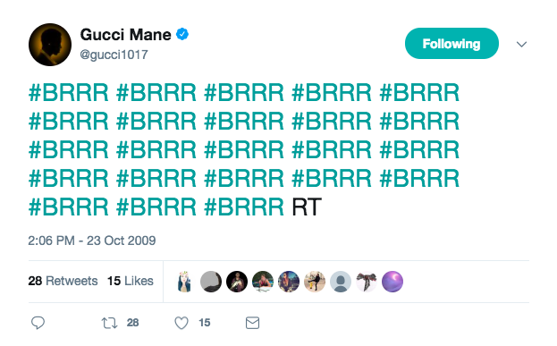

# `BRRR`

Let Gucci Mane tell you when your script is done.
=================================================

</img>

Have you ever wanted to know - and celebrate - when your simulations are
finally done running in R? Have you ever been so proud of pulling of a
tricky bit of code that you wanted Flavor Flav to yell "yeaaahhhh,
boi!!" as soon as it successfully completes? Have you ever gotten an
error message that felt like DJ Khaled yelling, "They don't wanna see us
win!"

Probably not, but you might now. And now, with BRRR, you can.

Inspired by and building from Rasmus Bååth's magnificent
[`beepr`](https://github.com/rasmusab/beepr) package, BRRR has one
function - `skrrrahh()`, which plays a rap adlib when it is called. It
is useful if you have a script that takes a while to run, and want to be
notified when it is finished.

`skrrrahh` is spelled with three R's and two H's, according to the
canonical [Genius.com](https://genius.com/12737380). I will not budge on
this.

Installation
------------

`BRRR` is available on Github and can be installed from within R by
running:

    if(!require(devtools)) {install.packages(devtools)}
    devtools::install_github("brooke-watson/BRRR")

Requirements
------------

If you are using Windows or OS X `BRRR` relies on the `audio` package
for sound playback and no external program is needed.

If you're on Linux `BRRR` relies on you having either the `paplay`
utility from the Pulse Audio system, the `aplay` utility from the ALSA
system or [VLC media player](http://www.videolan.org/vlc/index.html)
installed and on the PATH. Chances are that you alread have one of
these. If you are on Debian/Ubuntu you can otherwise get VLC by running
the following in a terminal:

    sudo apt-get install vlc

Details
-------

`skrrrahh` plays a short rap adlib which is useful if you want to get
notified, for example, when a script has finished. The package currently
includes 51 different sounds from *a number of different artists*. 50/51
of the sounds are pulled from [The Rap Board](therapboard.com) by [LP
Riel](http://www.lpriel.com/). \#\#\# Usage

`skrrrahh(sound = 1)` `skrrrahh()` `skrrrahh(0)` `skrrrahh("snoop")`
`skrrrahh(41)`

### Arguments

`sound` character string or number specifying what sound to be played by
either specifying one of the built in sounds or specifying the path to a
wav file. The default is 1. Possible sounds are:

    ##  [1] "2chainz"    "2chainz1"   "bigboi"     "biggie"     "bigsean"   
    ##  [6] "bigsean1"   "bigsean2"   "bigsean3"   "bigsean4"   "bigsean5"  
    ## [11] "bigshaq"    "birdman"    "birdman1"   "birdman2"   "busta"     
    ## [16] "chance"     "desiigner"  "diddy"      "drake"      "drake1"    
    ## [21] "drummaboy"  "fetty"      "flava"      "future"     "gucci"     
    ## [26] "gucci1"     "gucci2"     "jayz"       "jayz1.wav"  "kendrick"  
    ## [31] "khaled"     "khaled1"    "khaled2"    "khaled3"    "liljon"    
    ## [36] "liljon1"    "nicki"      "pitbull"    "ross"       "ross1"     
    ## [41] "schoolboy"  "snoop"      "soulja"     "takeoff"    "tpain.wav" 
    ## [46] "traviscott" "treysongz"  "trick"      "waka"       "weezy"     
    ## [51] "yg"

If `sound` does not match any of the sounds above, or is a valid path, a
random sound will be played.

### Examples

    # Play a random rap adlib.
    skrrrahh(0)

    # Update all packages and have Big Sean yell "Whoa Dere" when it is ready.  
    update.packages(ask=FALSE); skrrrahh(10)

    # Change your options to have DJ Khaled console you everytime you hit an error
    # message.
    options(error = function() {skrrrahh(33)})

    # The ting goes: 
    skrrrahh(11)
